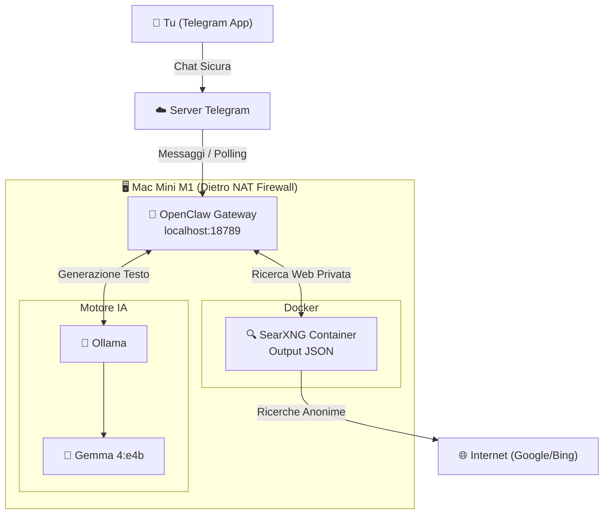

# 🤖 OpenClaw Personal AI Agent - Mac Mini M1 Setup

Benvenuto nella documentazione del mio assistente IA 100% privato, gratuito e ospitato localmente.
Questo progetto trasforma il mio Mac Mini M1 in un server di Intelligenza Artificiale indipendente.
Al momento è capace di fare ricerche sul web in totale anonimato e di interfacciarsi tramite Telegram.

### 📊 Schema Grafico Architettura (Fase 1)

Lo schema seguente illustra il flusso delle informazioni e l'isolamento dei componenti nel setup attuale. 
OpenClaw è l'unico componente a interfacciarsi con l'"esterno" tramite Telegram, mentre il modello e la ricerca web sono confinati in locale.

*Questa prima architettura rispecchia le indicazioni che ho trovato unendo le info di questi due video di Bart Slodyczka: [OpenClaw Full Tutorial](https://www.youtube.com/watch?v=BoC5MY_7aDk&list=PLi7jtY2ZZqRYb7LXb50IjnsdmUOFq0fAW&index=5) e [Gemma 4 + SearXNG Private Setup](https://www.youtube.com/watch?v=T0CKsU0hQx4&list=PLi7jtY2ZZqRYb7LXb50IjnsdmUOFq0fAW).*

## 🖥️ Hardware
* **Dispositivo:** Mac Mini M1 
* **Memoria:** 16GB RAM (Unified Memory). 
* **Rete:** Connessione Ethernet. Account iCloud disconnesso e nessuna password salvata!

*Curiosità tecnica:* Come confermato in [questo paper (arXiv:2510.18921)](https://arxiv.org/abs/2510.18921), per mettere in produzione un'applicazione AI su larghissima scala c'è bisogno delle GPU nei data center. Non si discute. Tuttavia, la combinazione dei chip Apple Silicon e del framework MLX offre un'alternativa competitiva ed economica. Far girare modelli complessi direttamente sul proprio pc è possibile senza dover pagare il cloud, ovviamente accettando tempi di inferenza leggermente superiori.

## ⚙️ Stack Software Attuale (Fase 1)
L'architettura attuale è pensata per **massimizzare** la privacy.

* **Cervello (Modello IA):** Gemma 4:e4b - Modello open source di Google.
* **Motore (Inference):** Ollama - Installazione su macOS dell'App ufficiale.
* **Gateway / Agente:** [OpenClaw](https://openclaw.ai/) - Framework.
* **Interfaccia Utente:** Telegram - Comunicazione tramite Bot dedicato gestito via BotFather.
* **Ricerca Web Privata:** [SearXNG](https://docs.openclaw.ai/tools/searxng-search) - Motore di metaricerca eseguito all'interno di un container **Docker**. Interroga Google/Bing in anonimato. *(Nota tecnica: il file `settings.yml` di SearXNG è stato configurato per abilitare l'output `- json`, essenziale per la lettura dei dati da parte di OpenClaw).*

## 🔒 Sicurezza Implementata (Security Baseline)
* **Telegram Allow List:** Il bot è blindato e risponde *esclusivamente* al mio ID Telegram personale.
* **Isolamento Gateway:** L'interfaccia di OpenClaw (porta 18789) è limitata a `127.0.0.1` (localhost). Non è accessibile dalla rete Wi-Fi locale o dall'esterno.
* **Nessun Port Forwarding:** Il Mac Mini è protetto dal firewall del router domestico (NAT).
* **Hardware Kill Switch:** L'alimentazione del Mac Mini è collegata a una presa smart (Tapo). In caso di comportamenti anomali (es. comandi non richiesti o loop), posso letteralmente "staccare la spina" da remoto tramite l'app sul telefono.

---

## 🚀 Roadmap e Sviluppi Futuri (Fase 2)
I prossimi passi sono: il test di altri modelli open-source e l'integrazione di **n8n** per gestire task ripetitivi (lettura email, aggiornamento fogli di calcolo), delegando all'agente IA solo l'analisi e risparmiando risorse di calcolo sul Mac.

- [ ] **Architettura Docker Ultra-Sicura ("[Metodo Bart](https://www.youtube.com/watch?v=7ekNNMmiNrM&list=PLi7jtY2ZZqRYb7LXb50IjnsdmUOFq0fAW&index=6)"):**
  - Creare un ecosistema Docker completo (Caddy, n8n, Postgres, Redis, OpenClaw).
  - **The Bodyguard:** Usare Caddy come reverse proxy e scudo contro il web.
  - **The Filter:** Esporre solo n8n per ricevere webhook esterni.
  - **The Backdoor:** Configurare n8n per comunicare con OpenClaw esclusivamente tramite una rete Docker interna isolata, garantendo che l'agente IA non sia mai toccato dal traffico internet pubblico.

Presa un po' di dimestichezza, altri concetti interessanti da esplorare sono:

- [ ] **Ecosistema di Sviluppo e PKM:** Integrare l'uso di **Claude Code** combinato con **NotebookLM** e **Obsidian**.
- [ ] **Architettura Multi-Agente:** Passare da un singolo assistente generico a un team di molteplici agenti IA che collaborano tra loro per risolvere task complessi in completa autonomia.

---

## 📚 Risorse e Documentazione
Per la lista completa di tutorial, paper scientifici e documentazione ufficiale che sto seguendo per il progetto 👉 **[Wiki delle Risorse](./docs/resources.md)**
