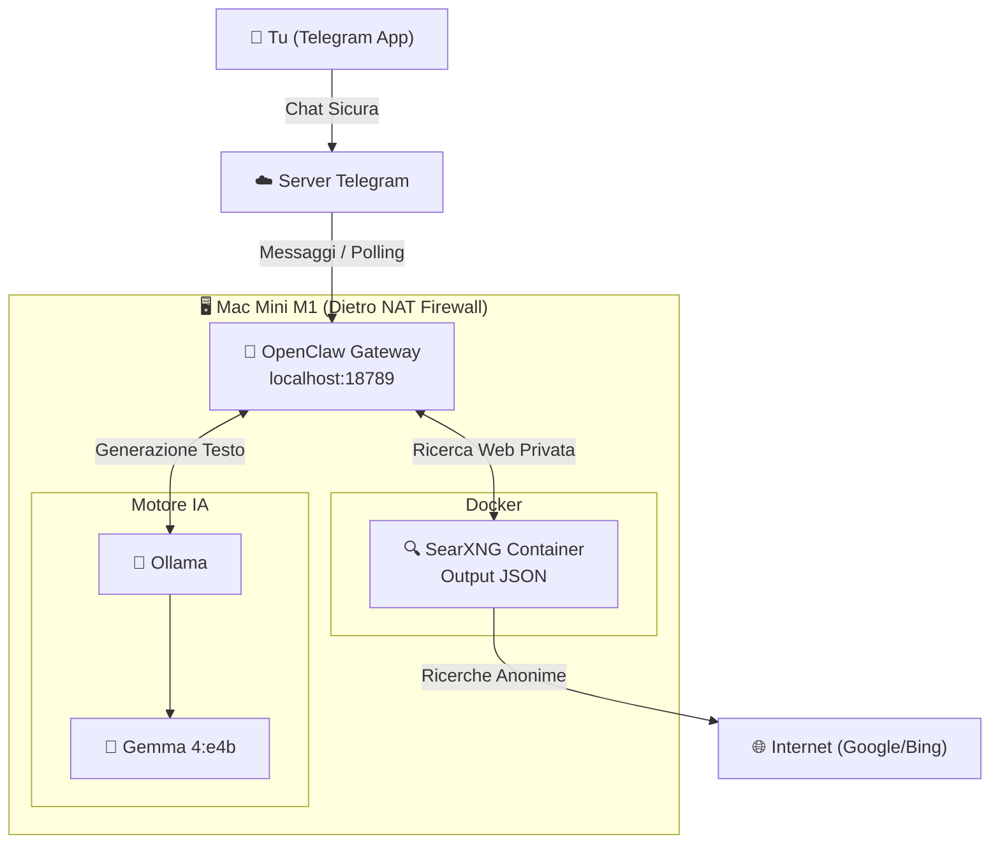

# 🤖 Local AI & Dev Workflow - Mac Mini M1 Lab

Benvenuto nella documentazione del mio ecosistema IA 100% privato, gratuito e ospitato localmente.
Questo progetto trasforma il mio Mac Mini M1 in un server indipendente, fungendo da laboratorio per diverse sperimentazioni.

### 🗺️ Mappa del Repository
```text
local-ai-devlog/
├── README.md           # La dashboard principale
├── docs/
│   └── resources.md    # 📚 Wiki: Link, paper scientifici e tutorial
├── logs/               # 📝 Diari di bordo e riflessioni architetturali
└── configs/            # ⚙️ File di configurazione isolati per strumento
````

-----

## 🦞 Progetto 1: Ecosistema OpenClaw (Stato: Attivo)

La prima implementazione trasforma il Mac in un assistente capace di fare ricerche sul web in totale anonimato e di interfacciarsi tramite Telegram.

### 📊 Schema Grafico Architettura (Fase 1)

Lo schema seguente illustra il flusso delle informazioni e l'isolamento dei componenti nel setup attuale.
OpenClaw è l'unico componente a interfacciarsi con l'"esterno" tramite Telegram, mentre il modello e la ricerca web sono confinati in locale.



*Architettura ispirata dalle logiche di Bart Slodyczka: [OpenClaw Full Tutorial](https://www.google.com/search?q=https://www.youtube.com/watch%3Fv%3DBoC5MY_7aDk) e [Private Setup](https://www.google.com/search?q=https://www.youtube.com/watch%3Fv%3DT0CKsU0hQx4).*

### 🖥️ Hardware

  * **Dispositivo:** Mac Mini M1
  * **Memoria:** 16GB RAM (Unified Memory).
  * **Rete:** Connessione Ethernet. Account iCloud disconnesso e nessuna password salvata\!

*Curiosità tecnica:* Come confermato nel [paper arXiv:2510.18921](https://arxiv.org/abs/2510.18921), per applicazioni AI su larghissima scala le GPU nei data center sono imprescindibili. Tuttavia, la combinazione dei chip Apple Silicon e del framework MLX offre un'alternativa competitiva ed economica. Far girare modelli complessi direttamente sul proprio pc è possibile senza dover pagare il cloud.

### ⚙️ Stack Software Attuale

L'architettura è pensata per **massimizzare** la privacy.

  * **Cervello (Modello IA):** Gemma 4:e4b - Modello open source di Google.
  * **Motore (Inference):** Ollama - Installazione su macOS.
  * **Gateway / Agente:** OpenClaw.
  * **Interfaccia Utente:** Bot Telegram dedicato.
  * **Ricerca Web Privata:** SearXNG eseguito all'interno di un container **Docker**. *(configurato per abilitare l'output `- json`).*

### 🔒 Sicurezza Implementata (Security Baseline)

  * **Telegram Allow List:** Il bot risponde *esclusivamente* al mio ID Telegram personale.
  * **Isolamento Gateway:** OpenClaw limitato a `127.0.0.1` (localhost). Non accessibile dal Wi-Fi.
  * **Nessun Port Forwarding:** Il Mac Mini è protetto dal firewall del router domestico (NAT).
  * **Hardware Kill Switch:** L'alimentazione è collegata a una presa smart (Tapo) per spegnimento d'emergenza da remoto.

### 🚀 Roadmap e Sicurezza (Fase 2)

Il prossimo step prevede l'integrazione di **n8n** per le automazioni. Abbandonata l'idea iniziale di usare Caddy (inutile e rischioso su una rete domestica), l'architettura di rete verrà blindata così:

  - [ ] **Docker Internal Network (`ai-net`):** Far comunicare OpenClaw e n8n esclusivamente su una rete invisibile e isolata.
  - [ ] **Tailscale Serve:** Esporre l'interfaccia di n8n in modo sicuro sulla mia VPN privata, evitando qualsiasi Port Forwarding sul router di casa.
  - [ ] **Podman Rootless:** Valutare la migrazione da Docker a Podman per eseguire i container senza privilegi di amministratore.

-----

## 💻 Progetto 2: Sviluppo con Claude Code & PKM (Stato: Ricerca)

Fase di studio parallela per valutare un "pivot" verso l'ecosistema Anthropic.

  - [ ] **Claude Ecosystem:** Test di **Claude Code CLI** (connettendolo a modelli locali via Ollama), valutazione di **Cursor IDE** vs l'estensione ufficiale Claude per VSCode.
  - [ ] **Ecosistema di Sviluppo e PKM:** Integrare questi tool di sviluppo con **NotebookLM** e **Obsidian** per una gestione avanzata della conoscenza personale.
  - [ ] **Architettura Multi-Agente:** Passare da un singolo assistente a un team di agenti specializzati e autonomi.

-----

## 📚 Risorse e Documentazione

Per la lista completa di tutorial, paper scientifici e documentazione ufficiale che sto seguendo per entrambi i progetti 👉 **[Vai alla Wiki delle Risorse](https://www.google.com/search?q=./docs/resources.md)**
